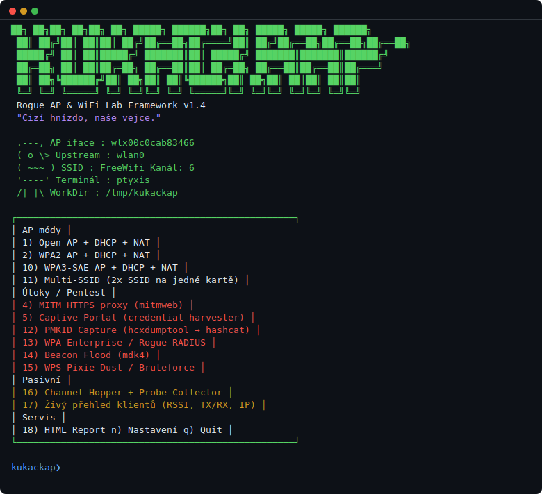

# KukačkAP 🐦

```
   .---,      K U K A Č K A P
  ( o   \>    Rogue AP & WiFi Lab Framework  v1.4.2
  ( ~~~  )    "Cizí hnízdo, naše vejce."
   '----'
   /|  |\     POUZE pro vlastní zařízení nebo autorizovaný pentest!
```

Bash framework pro WiFi penetrační testování a laboratorní experimenty.  
Spravuje hostapd, dnsmasq, iptables a útočné nástroje z jednoho interaktivního menu.

[](https://github.com/AlarmistOne/kukackap/releases/latest)
[](LICENSE)

> **⚠️ Pouze pro vlastní zařízení nebo autorizovaný pentest. Neoprávněné použití je trestné.**

---

## Demo



<details>
<summary>Textová verze banneru a menu</summary>

```
  ██╗  ██╗██╗   ██╗██╗  ██╗ █████╗  ██████╗██╗  ██╗ █████╗  █████╗ ██████╗
  ██║ ██╔╝██║   ██║██║ ██╔╝██╔══██╗██╔════╝██║ ██╔╝██╔══██╗██╔══██╗██╔══██╗
  █████╔╝ ██║   ██║█████╔╝ ███████║██║     █████╔╝ ███████║███████║██████╔╝
  ██╔═██╗ ██║   ██║██╔═██╗ ██╔══██║██║     ██╔═██╗ ██╔══██║██╔══██║██╔═══╝
  ██║  ██╗╚██████╔╝██║  ██╗██║  ██║╚██████╗██║  ██╗██║  ██║██║  ██║██║
  ╚═╝  ╚═╝ ╚═════╝ ╚═╝  ╚═╝╚═╝  ╚═╝ ╚═════╝╚═╝  ╚═╝╚═╝  ╚═╝╚═╝  ╚═╝╚═╝
            Rogue AP & WiFi Lab Framework  v1.4.2
                  "Cizí hnízdo, naše vejce."

  .---,     AP iface  : wlx00c0cab83466
 ( o   \>   Upstream  : wlan0
 ( ~~~  )   SSID      : FreeWifi    Kanál: 6
  '----'    Terminál  : ptyxis
  /|  |\    WorkDir   : /tmp/kukackap

┌──────────────────────────────────────────────────┐
│  AP módy                                         │
│     1) Open AP + DHCP + NAT                      │
│     2) WPA2 AP + DHCP + NAT                      │
│     3) Open AP + plný pcap                       │
│    10) WPA3-SAE AP + DHCP + NAT                  │
│    11) Multi-SSID (2x SSID na jedné kartě)       │
│                                                  │
│  Útoky / Pentest                                 │
│     4) MITM HTTPS proxy (mitmweb)                │
│     5) Captive Portal (credential harvester)     │
│     6) Evil Twin (clone real SSID + deauth)      │
│     7) Karma (odpovídá na všechny probe req)     │
│     8) WPA2 EAPOL handshake capture              │
│    12) PMKID Capture (hcxdumptool → hashcat)     │
│    13) WPA-Enterprise / Rogue RADIUS (hostapd-wpe│
│    14) Beacon Flood (mdk4)                       │
│    15) WPS Pixie Dust / Bruteforce (reaver/bully)│
│                                                  │
│  Pasivní                                         │
│     9) 802.11 monitor (beacons/probes/deauth)    │
│    16) Channel Hopper + Probe Collector          │
│    17) Živý přehled klientů (RSSI, TX/RX, IP)   │
│                                                  │
│  Servis                                          │
│    18) HTML Report (credentials, DNS, DHCP, pcap)│
│     n) Nastavení (SSID, kanál, rozhraní)         │
│     s) Status   d) Závislosti   k) Kill   q) Quit│
└──────────────────────────────────────────────────┘

kukackap❯ _
```

</details>

---

## Požadavky

| Nástroj | Povinný | Instalace |
|---|---|---|
| `hostapd` | ✅ | `sudo apt install hostapd` |
| `dnsmasq` | ✅ | `sudo apt install dnsmasq` |
| `iw`, `iptables` | ✅ | `sudo apt install iw iptables` |
| `network-manager` | ✅ | `sudo apt install network-manager` |
| `python3` | ✅ | `sudo apt install python3` |
| `tcpdump` | ✅ | `sudo apt install tcpdump` |
| `tmux` | volitelný | `sudo apt install tmux` |
| `mitmproxy` | volitelný | `pipx install mitmproxy` |
| `aircrack-ng` | volitelný | `sudo apt install aircrack-ng` |
| `hcxdumptool` + `hcxtools` | volitelný | `sudo apt install hcxdumptool hcxtools` |
| `hostapd-wpe` | volitelný | `sudo apt install hostapd-wpe` |
| `mdk4` | volitelný | `sudo apt install mdk4` |
| `reaver` | volitelný | `sudo apt install reaver` |

---

## Spuštění

```bash
sudo bash kukackap.sh
```

Nebo s vlastním rozhraním / SSID:

```bash
sudo AP_IFACE=wlan1 SSID="Corp-Guest" CHANNEL=11 bash kukackap.sh
```

---

## Módy

### 📡 AP módy
| # | Název | Popis |
|---|---|---|
| 1 | Open AP + DHCP + NAT | Otevřená síť s internetem |
| 2 | WPA2 AP + DHCP + NAT | Zabezpečená síť s heslem |
| 3 | Open AP + plný pcap | Otevřená síť + zachytávání provozu |
| 10 | WPA3-SAE AP | WPA3 s SAE + PMF |
| 11 | Multi-SSID | 2 SSID na jedné kartě (10.0.0.x / 10.0.1.x) |

### ⚔️ Útoky / Pentest
| # | Název | Popis |
|---|---|---|
| 4 | MITM HTTPS proxy | Transparentní proxy přes mitmweb |
| 5 | Captive Portal | Falešný přihlašovací portál (3 šablony) |
| 6 | Evil Twin | Klon reálného SSID + deauth flood |
| 7 | Karma | Odpovídá na všechny probe requesty |
| 8 | WPA2 EAPOL handshake | Zachytávání handshake pro offline crack |
| 12 | PMKID Capture | Zachytává PMKID bez nutnosti klienta → hashcat |
| 13 | WPA-Enterprise / Rogue RADIUS | Falešný 802.1X AP, zachycuje MSCHAPv2 hashe |
| 14 | Beacon Flood | Zaplavení okolí falešnými SSID (mdk4) |
| 15 | WPS Pixie Dust / Bruteforce | Útok na WPS PIN (reaver / bully) |

### 🔍 Pasivní
| # | Název | Popis |
|---|---|---|
| 9 | 802.11 monitor | Pasivní sběr beacon/probe/deauth rámců |
| 16 | Channel Hopper | Skákání po kanálech + live sběr probe requestů |
| 17 | Živý přehled klientů | Tabulka připojených klientů (RSSI, TX/RX, IP) |

### 🛠️ Servis
| # | Název | Popis |
|---|---|---|
| 18 | HTML Report | Generuje přehledný report ze všech logů |
| n | Nastavení | Změna SSID, kanálu, rozhraní |
| s | Status | Přehled běžících procesů a DHCP leases |
| d | Závislosti | Kontrola nainstalovaných nástrojů |
| k | Kill / cleanup | Zastavení všeho, reset rozhraní |

---

## Captive Portal — šablony

Mód 5 nabízí výběr šablony přihlašovacího portálu:

| # | Styl | Popis |
|---|---|---|
| 1 | Apple iOS | Jednoduchá bílá karta, system-ui font |
| 2 | Android Material | Material You, fialová, zaoblené rohy |
| 3 | Corporate | Tmavý gradient, firemní vzhled, AUP checkbox |

Zachycené přihlašovací údaje se logují do `/tmp/kukackap/logs/credentials.log`.

---

## Proměnné prostředí

```bash
AP_IFACE=wlx00c0cab83466   # WiFi karta pro AP
UPSTREAM=wlan0              # Upstream rozhraní (internet)
SSID=FreeWifi               # Název sítě
CHANNEL=6                   # Kanál (1-13 pro 2.4 GHz)
```

---

## Struktura logů

```
/tmp/kukackap/
├── logs/
│   ├── hostapd.log
│   ├── dnsmasq.log
│   ├── credentials.log      # Portal přihlášení
│   ├── wpe-creds.log        # WPA-Enterprise hashe
│   ├── pmkid-HHMMSS.hc22000 # Hashcat formát
│   └── capture-HHMMSS.pcap  # Packet capture
└── report-YYYYMMDD-HHMMSS.html  # HTML report
```

---

## Terminálová podpora

Automaticky detekuje: `ptyxis`, `kgx`, `gnome-terminal`, `xfce4-terminal`, `konsole`, `tilix`, `alacritty`, `kitty`, `xterm`, `tmux`.  
Bez GUI terminálu spouští vše na pozadí s logováním do souboru.

---

## Licence

Distribuováno pod licencí [MIT](LICENSE).

Pouze pro vzdělávací účely a autorizované penetrační testování.  
Autor nenese odpovědnost za zneužití.
